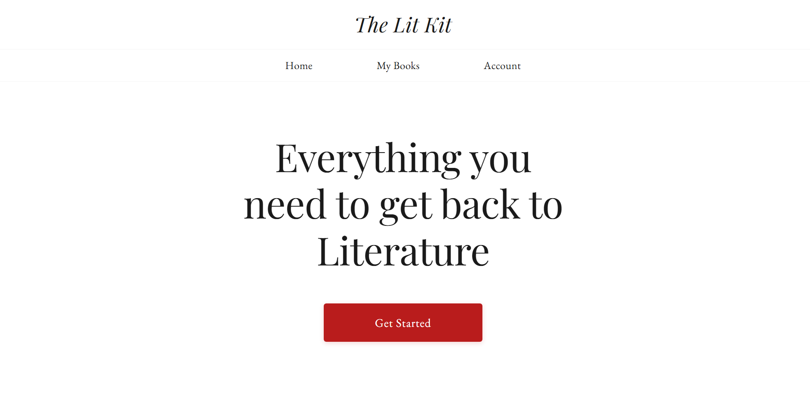
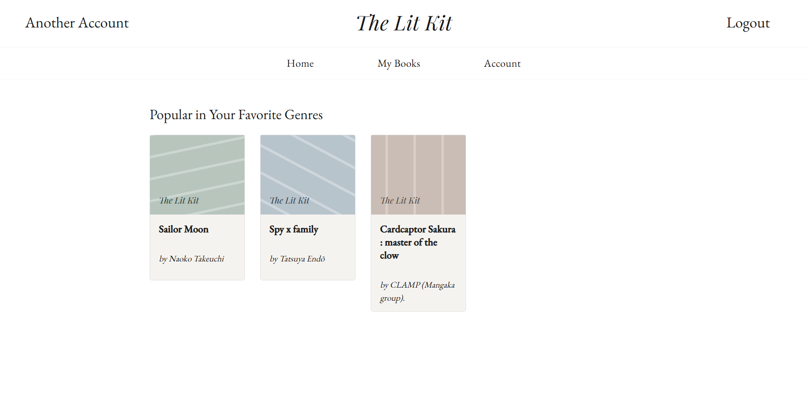
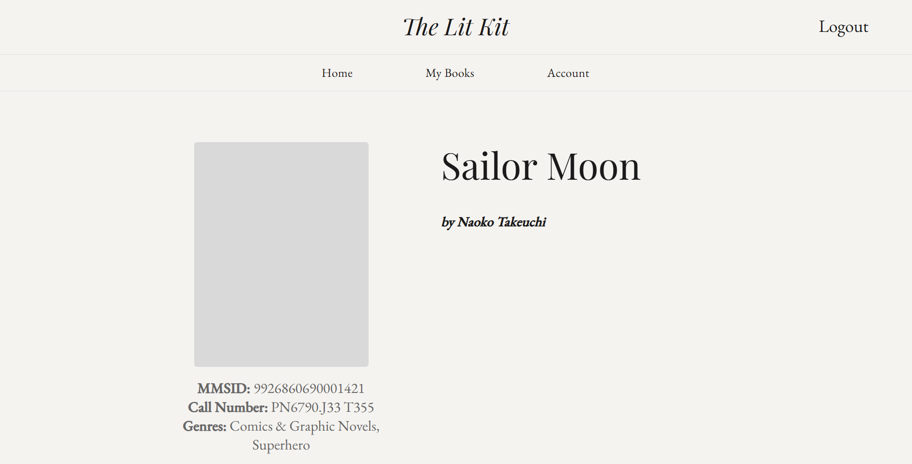
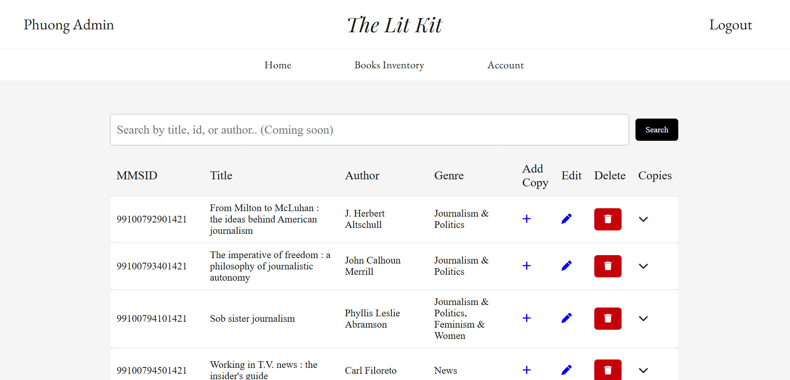

# The Lit Kit
The Lit Kit is a team project for Database System course at UTDallas. This project is a book recommendation system for library which combines a relational database with book metadata and tag-based recommendation logic to help users discover books that match user's interests.

Access it here: [The Lit Kit](https://thelitkit.page.gd/)

**Disclaimers**: the book data belongs to UTDallas McDermott Library. The circulation data in this is recorded from 2013 to 2/2026

# Functions
**User Function**
- Use book genres to get recommended books
- Viewing books information included: name, author, location, and genre
- User account functionality
**Admin Function**
- Administrative interface for managing library data
- Relational database for storing books, authors, genres, tags

# Recommendation System

The-Lit-Kit uses book metadata and genres to identify books with similar characteristics.

Book information is processed and organized into relational database tables. Recommendations are generated by comparing the characteristics associated with books and identifying relevant matches.

This approach allows the system to recommend books without requiring a large amount of user history.

# Database

The project uses a relational database to organize library information and maintain relationships between different entities.

The database includes information such as:

* Users
* Books
* Authors
* Genres
* Book genres
* Circulation information

Primary and foreign keys are used to establish relationships between tables and reduce unnecessary data duplication.

# Data Processing

Library book data was cleaned and transformed before being imported into the application database.

The dataset contains information such as:

* Book identifiers
* Titles
* Authors
* Genres
* Circulation-related information

Python was used for data preparation and processing, while SQL was used to store, query, and manage the resulting data.

**Library Metadata Mapping System**
The mapping system can be found here (created by Phuong Le): [LCSH Genre Mapping Function](https://github.com/lphuong25/lcsh-genre-mapping)

# Tech Stack
| Technology     | Purpose                           |
| -------------- | --------------------------------- |
| **PHP**        | Backend / server-side application |
| **MySQL**      | Relational database               |
| **SQLite**     | Local database / development      |
| **Python**     | Data processing and preparation   |
| **SQL**        | Database queries and management   |
| **HTML/CSS**   | User interface                    |
| **JavaScript** | Frontend functionality            |
| **Git/GitHub** | Version control                   |

# Application
Home Page



Book Recommendations



Book Details



Admin Dashboard



# Running Locally
### Prerequisites

* PHP
* MySQL
* Python 3
* A local PHP development environment such as XAMPP

### Setup

1. Clone the repository:

```bash
git clone https://github.com/lphuong25/The-Lit-Kit/tree/main
```

2. Create the required database.

3. Import the provided database schema/data.

4. Configure the database connection using environment variables.

5. Start your local PHP server or XAMPP environment.

6. Open the application in your browser.

> **Note:** Database credentials are not included in this repository. Create your own environment configuration using the example below.

# Environment Variables

Create a .env file using the example and provide your own database credentials.

Example:

DB_HOST=your_database_host
DB_USERNAME=your_database_username
DB_PASSWORD=your_database_password
DB_NAME=your_database_name

Never commit .env or other files containing real credentials to GitHub.

# Deployment

The application is currently deployed using InfinityFree for demonstration purposes.

The deployed application connects to a MySQL database hosted through the same hosting environment.

# Future Improvements

Possible future improvements include:

* Implement advanced administrative book search and filtering
* Add the ability for users to save books to a personal library
* Expand personalized recommendations using user preferences and reading history
* Add additional recommendation methods based on book similarity
* Improve filtering and discovery features

# Project Context

This project was developed as part of CS 4347 – Database Systems at The University of Texas at Dallas.

The project provided hands-on experience with:

* Relational database design
* SQL queries
* Database normalization and relationships
* Data cleaning and preparation
* Web application development
* Connecting a web application to a relational database
* Building a data-driven recommendation feature

# Contributors

Developed as a team project for CS 4347.

# License

This project was created for educational and portfolio purposes.

# Special Thanks
Special Thanks to UTDallas McDermott Library's staff for providing the data, advising and allowing us to work on and present the application.